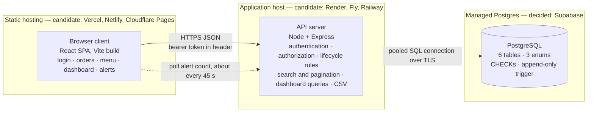

# Architecture

**How to read this document.** Every technology choice below is marked one of two ways:

- **Decided** — settled, with reasoning recorded in [`decisions.md`](decisions.md). Changing it would
  change the design.
- **Candidate** — the *role* is settled; the specific product filling it is a placeholder. Swapping
  it changes nothing else in this document.

## High-level design

Browser code never touches the database. The API is the only writer. The dotted edge is the only
"push" in the system, and it is done by polling.

## The three pieces

| Piece | Responsible for | 
|-------|-----------------|
| **Browser client** *Decided:* React, Vite, React Router *Candidate:* server-state library (TanStack Query, SWR, plain fetch), charting library (Recharts, Chart.js) | Rendering, forms, hiding controls a role cannot use | 
| **API server** *Decided:* Node + Express *Candidate:* database client library, token library, password hashing library, validation library | Authentication, per-order authorization, the lifecycle state machine, writing history in the same transaction as the change, list queries, dashboard aggregates, CSV, bulk menu updates with per-item results | 
| **PostgreSQL** *Decided:* PostgreSQL  | Referential integrity, enums, CHECK constraints, the append-only history trigger, all aggregation | 

## Where each piece runs

| Piece | Host | Status | Notes |
|-------|------|--------|-------|
| Browser client | Static CDN | **Candidate:** Vercel | Needs an SPA rewrite so refreshing `/orders/42` does not 404 |
| API server | Container / web service, free tier | **Candidate:** Render | Free tiers sleep when idle; first request after idle can take ~1 minute. Will be noted in `SUBMISSION.md`, with a `/health` endpoint to wake it |
| PostgreSQL | Managed Postgres | **Decided:** Supabase | Two pooled connection strings, not interchangeable: transaction mode for the API, session mode for migrations. The direct string is IPv6-only and unusable from the API host. See [Decision 7](decisions.md#decision-7--one-hosted-database-for-development-and-deployment) |

The API host is still interchangeable: the only requirement the design places on it is that it can
hold a connection pool. The database host is not, any more. `002_lockdown.sql` closes the REST
surface Supabase generates over every table, and that file means nothing on another host.

## How the pieces talk

**Proving who you are.** *Decided:* the client sends a signed, stateless token on every request
rather than using a cookie session, because the client and API live on different hosts and
cross-site cookies cost an afternoon of CORS work the budget does not have.
*Candidate:* JWT via `jsonwebtoken` for the token itself, and bcrypt or argon2id for the password
hash. The hashing algorithm is not load-bearing; what is decided is that a raw password is never
stored, only a hash.

**Deciding what you may do.** Always on the server. Two checks, and they fail differently:

- **Role** — does this kind of user get this capability at all? A waiter calling a menu-management
  route gets **403**. 
- **Object** — is this particular order yours? Manager, primary waiter, or collaborator. Anyone else
  gets **404**, not 403, because order IDs are sequential and a 403 would confirm which ones exist.

List visibility is a `WHERE` clause, never "load everything and filter in the browser" — which is
also what §6 explicitly requires.

**Reporting failure.** One error shape across every route, carrying a code and a sentence meant for
a person. The UI shows that sentence directly; that is how §4's "message explaining why" actually
reaches the waiter. Codes: 401 unauthenticated, 403 capability denied, 404 not yours, 409 state rule
violated, 422 invalid payload. Full table in
[`api.md` → Failure codes](api.md#failure-codes-and-the-rule-behind-them).

## Request path end to end

Representative action from
[`api.md` → Any authenticated user](api.md#any-authenticated-user-both-roles): **a waiter sits a
party at table T12 and starts an order for them.** The round trip, in both directions:

| | Where | What happens |
|---|-------|--------------|
| ↓ | **Waiter** | Taps "New order", types the table number — `T12` — and submits. |
| ↓ | **UI** | Checks the field is not empty and disables the button, so an impatient second tap cannot create two orders for the same table. Sends the table number to the API with the waiter's token attached.  |
| ↓ | **API — who are you?** | The token is turned back into an identity: *waiter, id 7*. Missing, expired or tampered with, and the request is stopped there. |
| ↓ | **API — may you do this?** | This request is the moment ownership gets *created*: whoever sends it becomes the order's primary waiter, and every later permission question about this order traces back to here. |
| ↓ | **API — is it allowed right now?** | The table number must be valid. |
| ↓ | **Database** | Creates an entry in the 'orders' table. The DB creates a new order ID and marks the status as placed. Creates a corresponding entry in the 'order-timeline' table. |
| ↑ | **Database → API** | The new id comes back. |
| ↑ | **API → UI** | `201 Created`, carrying the order as the server now sees it: id, table number, status Placed, its primary waiter, an empty list of items, and a total of zero. |
| ↑ | **UI** | Drops the new order into the waiter's list. |
| ↑ | **Waiter** | Sees an empty order for T12, ready to take food into. |

**Every other action follows the same ten stages.** Only two of them differ — *may you do this?* and
*is it allowed right now?* — which is exactly why those two live in shared middleware instead of
being rewritten inside each route:

| User action | May you do this? | Is it allowed right now? | Written to history as |
|-------------|------------------|--------------------------|----------------------|
| **Create an order** | anyone signed in | the table number must be valid | created |
| Add an item | manager, primary waiter, or collaborator | order not yet Served or Cancelled | line added |
| Void an item | same | order still open, and a reason given | line voided |
| Advance status | same | the move must be legal from where the order is now | status changed |
| Cancel the order | same | only while still Placed or Accepted | status changed |
| Add a collaborator | same | target is a waiter, not already on the order | collaborator added |
| Acknowledge a slow-order alert | same | the order is actually alerting | alert acknowledged |
| Change prices in bulk | **managers only** | each item judged on its own, so one bad price does not sink the batch | *menu change, not order history* |

## What I decided not to build

As of now, the goal is to implement exactly the 10 core requirements. 
